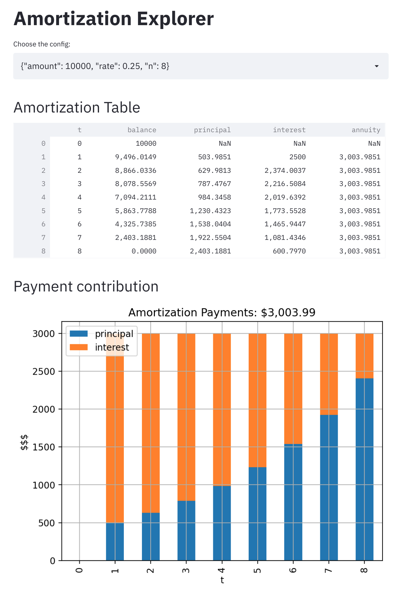

# Amortization

This is a simple python application that facilitate
the creation and exploration of amortization tables.

## Usage

The application is straightforward:
1. Run the setup command.
2. Create amortization tables.
3. Use the explorer to analyze the results.

### Command: setup

Use the `setup` command to configure the python application.

```commandline
$ python -m amortization setup
```

### Command: table

Use the `table` command to create amortization tables.

Arguments:
* `--amount`: The initial loan amount.
* `--n`: The number of periods.
* `--rate`: The interest rate.
* `--show`: (Optional) If the table should be shown in the commandline.
* `--save`: (Optional) If the results should be saved as a csv file.

```commandline
$ python -m amortization table --amount 50000 --rate 0.06 --n 18 --save --show
```

```commandline
$ python -m amortization table --amount 10000 --rate 0.25 --n 8 --save
```

### Command: explorer

Use the `explorer` command to start the streamlit application and
visualize the amortization tables.

```commandline
$ python -m amortization explorer
```

