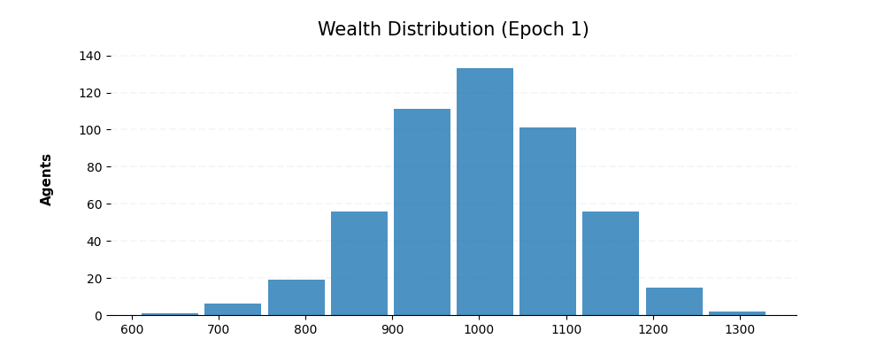
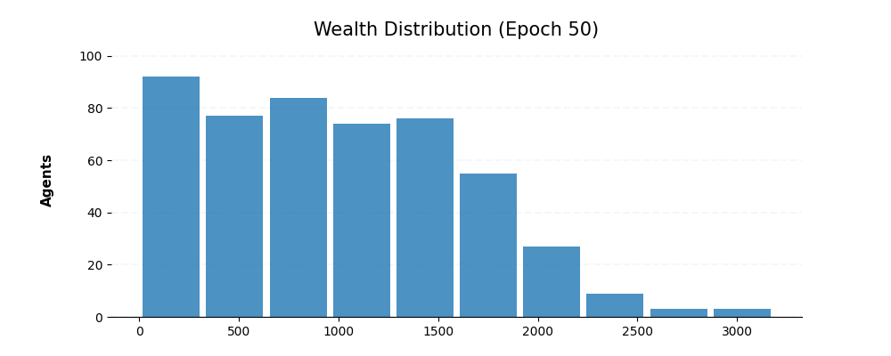
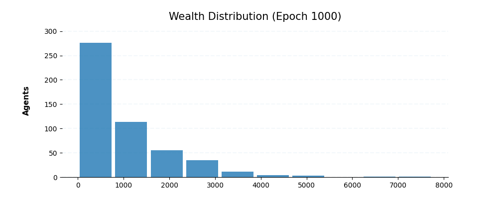

# Wealth Distribution

This is a simple python application that allows you to represent a simple trading game within an economy and analyze the 
wealth distribution.

Simulation principles:
* An economy is composed by a finite number of economic agents.
* Each economic agent has resources with a monetary value between 0 and `m`.
* The agents are allowed to trade in pairs.
* Each trade has a winner (+1) and a loser (-1).
* Winners are selected randomly.


For more context please read the following resources:

* [Statistical mechanics of money](http://www2.physics.umd.edu/~yakovenk/papers/EPJB-17-723-2000.pdf) - Department of Physics, University of Maryland.
* [Money Distributions in Chaotic Economies](https://arxiv.org/pdf/0906.1899.pdf) - Universidad de Zaragoza


## Results

**Epoc 1**: Creates a semi-normal distribution.



**Epoc 50**: The distribution starts to shift, accumulating more agents at lower values.



**Epoc 1000**: Eventually, the distribution converges to a Boltzmann-Gibbs distribution (pareto-like distribution).



## Instructions

This simulation app is missing some code.
Follow the instructions on this file to complete the codebase.

1. Create a branch named `HW-WEALTH`
2. Add your implementation and push the changes.
3. Create the PR from `HW-WEALTH` into `master`.
    * DO NOT MERGE!
   
## (1 pts) Agent: Complete the win/lose methods

Complete the win & lose methods on the `Agent` class so that:

```python
agent = Agent(100)

# You should be able to win 20 monetary units
agent.win(amount=20)
assert agent.money == 120

# You should be able to lose 10 monetary units
agent.lose(amount=10)
assert agent.money == 110
```

## (1 pts) Agent: Complete the trade methods 

Complete the trade method in the agent class so that:

```python
agent_a = Agent(100)
agent_b = Agent(100)

# Two agents should be able to trade
trading_amount = 25
agent_a.trade(agent_b, amount=trading_amount)

assert agent_a.money + agent_b.money == 200
assert abs(agent_a.money - agent_b.money) == 2*trading_amount
```

* The winning agent should be chosen randomly.

## (3 pts) Update the `simulate` command so that you can add a custom trading amount.

Add the following argument: `--trading-amount`

```commandline
$ python -m wealth-distribution simulate --population 500 --epochs 10000 --trading-amount 10
```
